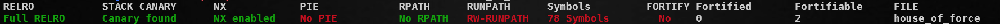

# Overall

 
**When a program allocates memory from the heap, the operating system allocates a block of physical memory (or a combination of physical and disk memory) and assigns a virtual address to it. This virtual address becomes part of the process's virtual address space and can be used by the program to access the allocated memory.**

- ***Virtual Memory (VA)*** 
    - It's a memory management technique employed by operating systems to provide processes with the illusion of having more contiguous physical memory (RAM) than is actually available.
    - The operating system maintains a translation table that maps virtual addresses used by a process to physical addresses in RAM or on secondary storage (like a hard disk).
    - This allows processes to use more memory than physically present by swapping data between RAM and disk as needed.
- ***Heap***
    - The heap is a region of memory within a process's virtual address space. 
    - It's managed dynamically during program execution. Programs can allocate and deallocate memory from the heap using functions like malloc (allocate) and free (deallocate) in C/C++.
    - The heap is typically used to store dynamically allocated objects or data structures whose size is not known at compile time.
- The heap itself is not a separate address space. It exists within the process's virtual address space managed by the operating system's virtual memory mechanism. 

***In GLIBC versions < 2.29***, top chunk size fields are not subject to any integrity checks during allocations. If a top chunk size field is overwritten using e.g. an overflow and replaced with a large value, subsequent allocations from that top chunk can overlap in-use memory. Very large allocations from a ***corrupted top chunk can wrap around the VA space in GLIBC versions < 2.30***.
- For example, a top chunk starts at address 0x405000 and target data residing at address 0x404000 in the program’s data section must be overwritten. Overwrite the top chunk size field using a bug, replacing it with the value 0xfffffffffffffff1. Next, calculate the number of bytes needed to move the top chunk to an address just before the target. The total is 0xffffffffffffffff - 0x405000 bytes to reach the end of the VA space, then 0x404000 - 0x20 more bytes to stop just short of the target address. 

# Approach

- ***Overwrite a top chunk size field*** with a *large value*, ***then request enough memory*** to bridge the gap between the top chunk and target data. ***Allocations*** made in this way can wrap around the VA space, allowing this technique to target memory at a lower address than the heap.

- Each of malloc's core functions, such as malloc() and free(), has an associated hook which takes the form of a writable function pointer in GLIBC's data section. Under normal circumstances these hooks can be used by developers to do things like implement theirown memory allocators or to collect malloc statistics.

# Further use 
- ***If the target resides on the same heap as the corrupt top chunk***, leaking a heap address is not required, the allocation can wrap around the VA space back onto the same heap to an address relative to the top chunk. 
- The malloc hook is a viable target for this technique because passing arbitrarily large requests to malloc() is a prerequisite of the House of Force. Overwriting the malloc hook with the address of system(), then passing the address of a “/bin/sh” string to malloc masquerading as the request size becomes the equivalent of system(“/bin/sh”).

# Limitations
- ***GLIBC version 2.29*** introduced a top chunk size field sanity check, which ensures that the top chunk size does not exceed its arena’s system_mem value. 
- ***GLIBC version 2.30*** introduced a maximum allocation size check, which limits the size of the gap the House of Force can bridge. 

