# House of Orange

***This challenge is in the Linux Heap Exploitation - Part 1, and it is worth to write something about it.***

## Overall


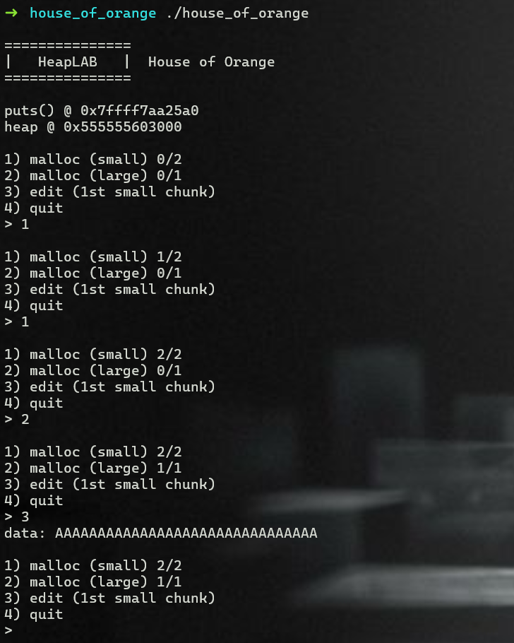

Challenge gives me 4 options as the image above.

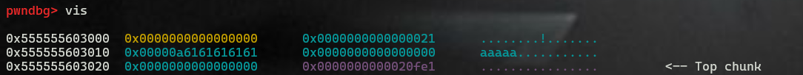

- If i only request malloc(small) and edit with data: aaaaa

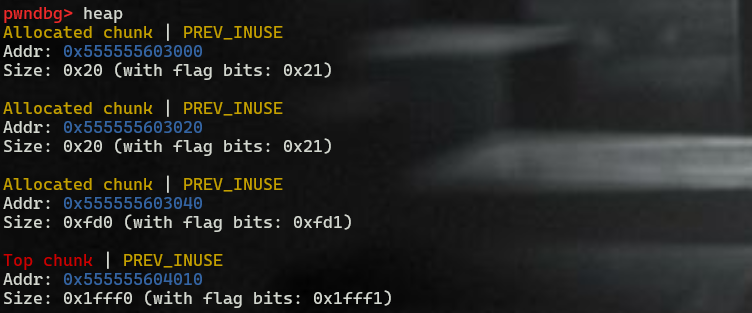

- malloc(small): call malloc() with the size 0x20
- malloc(large): call malloc() with the size 0xfd0
- edit: write data to the start of small chunk
- quit: simply exit the program.

***However the challenge doesn't give me free()...***

### Bug


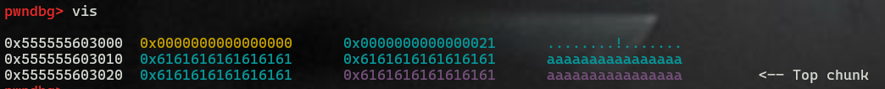

***As you see, I can overwrite the heap.***


## Approach
### Create free chunk

The challenge doesn't give me free option(), but it allows me to overwrite the heap(chunk size, prev_size,..... include of top chunk size).


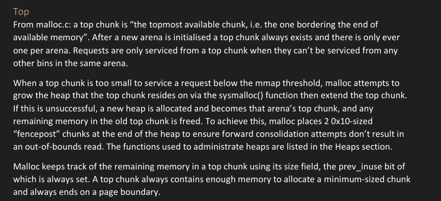
- Document for ***top chunk*** in ***HeapLab - GLIBC Heap Exploitation.pdf***

I can create an unsorted bin by **overwriting the size field of the top chunk** -> **request a larger size** than this size.

Main Arena will use brk syscall to request the new memory from kernel. Because the new memory doesn't border the end of the heap. Thus, malloc assume that the kernel was unable to map contiguous memory from the heap. Since the new memory is larger, malloc starts a new heap from it(set top chunk pointer to the new memory) and so as not to waste space, it frees the old top chunk. 

#### Notice
> Malloc keeps track of the remaining memory in a top chunk using its size field, the prev_inuse bit of 
> which is always set. A top chunk always contains enough memory to allocate a minimum-sized chunk 
> and always ends on a page boundary. 

#### Overwiting top chunk size with: **0x1000 - 0x20 + 1**, then request the large size

#### The result

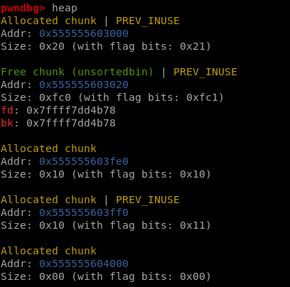


### Find the target

#### Unsortedbin attack
I can write the address of unsortedbin to somewhere(fd + 0x10) by following bk pointer to overwrite this address to fd poiner. 

#### Target file stream

If the program uses fopen or something else, the file steam will be used. Or if not, there will also be one because the program always contains stdin(0), stdout(1), and stderr(2).

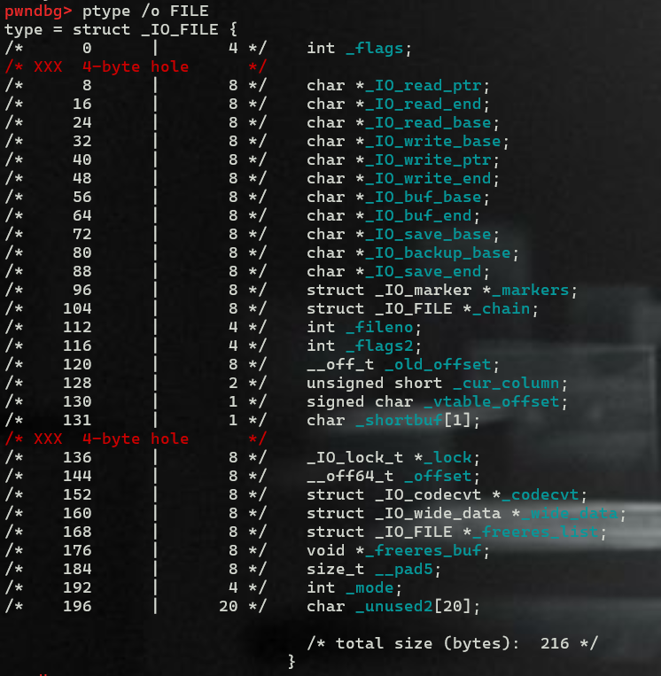


***However, what if I target one of the standard I/O vtable pointer.***
- Our unsortedbin attack would replace that vtable pointer with the address of the main arena's unsortedbin. Then the next time a standard I/O member function was called, the main arena would be treated as a vtable.
- The main arena consists primarily of empty linked lists at this point, and attempting to execute those addresses would just lead to a general protection fault as we tried to execute memory marked as non-executable. Even if I were to populate some of those bins with pointers to heap memory by sorting chunks into them, heaps are no more executable than arenas.


***Fortunately, I have _IO_list_all pointer(the head of a list of every file stream).***

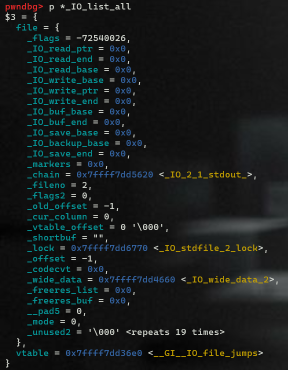

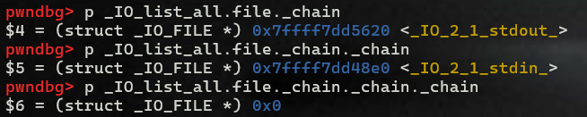

- This process has open and it's used when GLIBC needs to perform an operation on all open file streams, typically cleanup procedures. One of those cleanup procedures is performed when a program exits, either via the GLIBC exit() function or by returning from its main() function.

**Conclusion**
- I will target the _IO_list_all pointer with our unsortedbin attack, replacing it with a pointer into the main arena, then we exit the program. As the program exits and GLIBC cleans up, it will attempt to flush the buffers of any open file streams.
- It does this by iterating over every file stream in the _IO_list_all list, determining whether its buffers require flushing, and if so, calling a specific member function named 'overflow' on that file stream, nothing to do with this sort of overflows.


### Set up

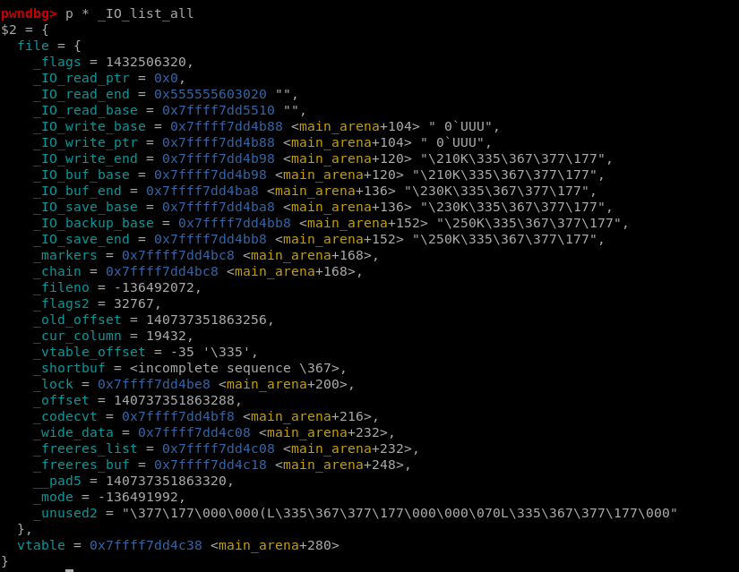

Now, I have what I want. 

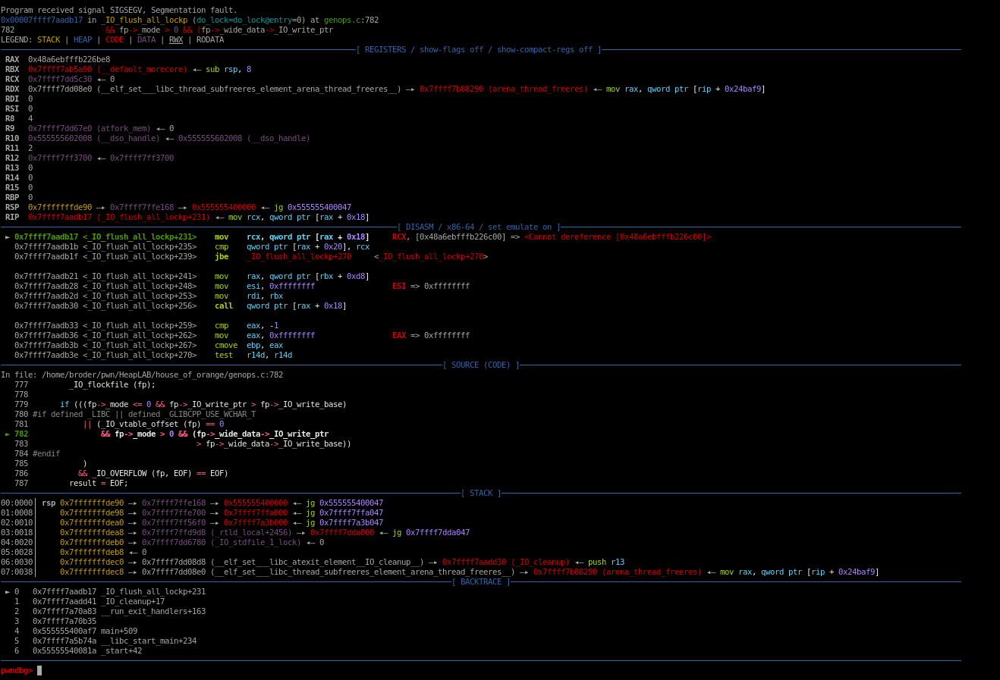
- However, the program get segmentation fault. 
- And _IO_flush_all_lockp() uses to determine whether a file stream requires flushing.
- The reason for that is this file stream doesn't pass the check.
    - 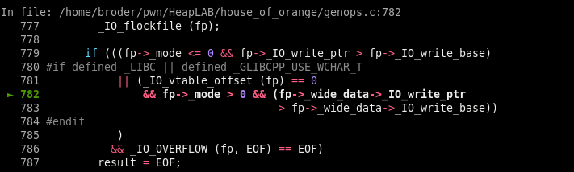
    - After all this function is trying to treat the main arena like a file stream. The line containing _IO_OVERFLOW in all caps is the one calling the 'overflow' member function. The first argument, 'fp', represents the file stream overflow() is being called from.
    - There are two checks prior to this line, each one of which must pass in order for overflow() to be called. 
        - The first check passes if the '_mode' field of the file stream is less than or equal to zero and its _IO_write_ptr field is larger than its _IO_write_base field. 
        - The second check _mode larger than zero. 
    - It will fail the first check due to the latter and the second check due to the former.
- In this case _IO_flush_all_lockp() won't call this file stream's overflow() function and will instead move on to the next stream the current stream's _chain pointer(_chain points back into the main arena).
    - 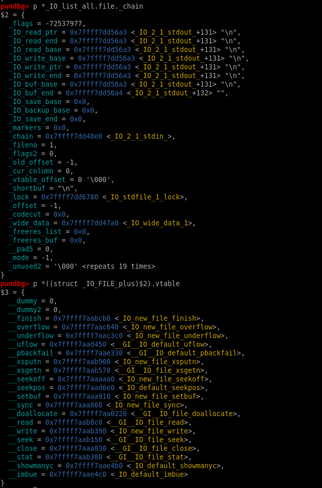
    - 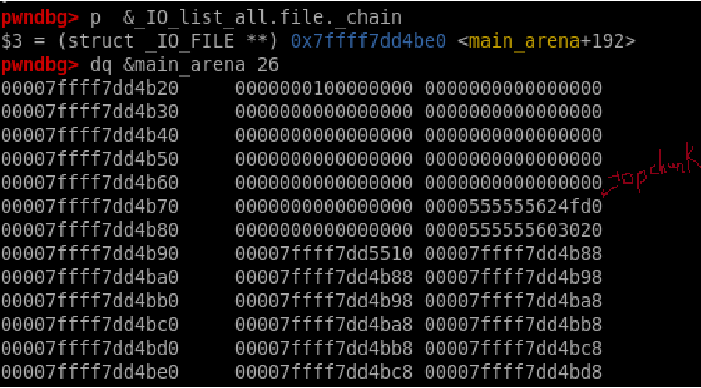
    - ***The bk of the 0x60 smallbin is what's being treated as this rogue file stream's _chain pointer.***   
 
- So if we change the size field of the old top chunk from 0x21 to 0x61 before our unsortedbin attack, the old top chunk will be sorted into the 0x60 smallbin rather than being allocated, and end up as the _chain pointer of the rogue file stream overlapping the main arena. This allows me to forge our own fake file stream on the heap, providing our own vtable pointer and vtable entries

***Let's build the fake file stream.***

Change my script little

```python=
size = 0x61
fd = 0x0
bk = libc.sym['_IO_list_all'] - 0x10

unsortedbin_attack = b'Y'*16 +\
flag + p64(size) +\
p64(fd)  + p64(bk) +\
b'a'*8 + b'b'*8
edit(unsortedbin_attack)
malloc_small()
quit()
```

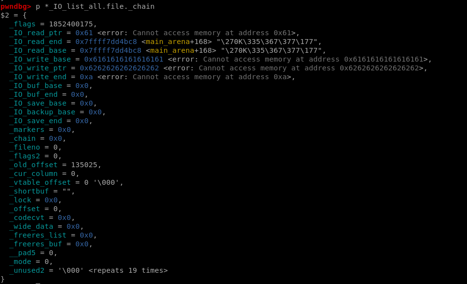

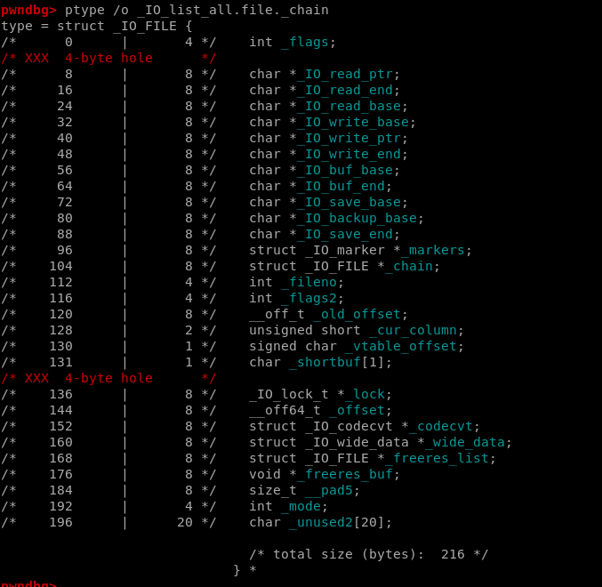

**Now, we need to pass the check**
- `fp > write_ptr > write_base`
- `fp -> mode <= 0`

Afterwards, I need to set up to call system("/bin/sh"). 
- I provide a vtable pointer to a vtable in which the overflow() entry is populated by the function. 
- When the overflow() function is called, its first argument is the address of the file stream it's called from. That means if I write the string "/bin/sh" into the first quadword of our file stream, which is where the '_flags' field resides, then point the overflow() vtable entry at the GLIBC system() function, the call becomes system("/bin/sh") and I get a shell without the need for a one-gadget.