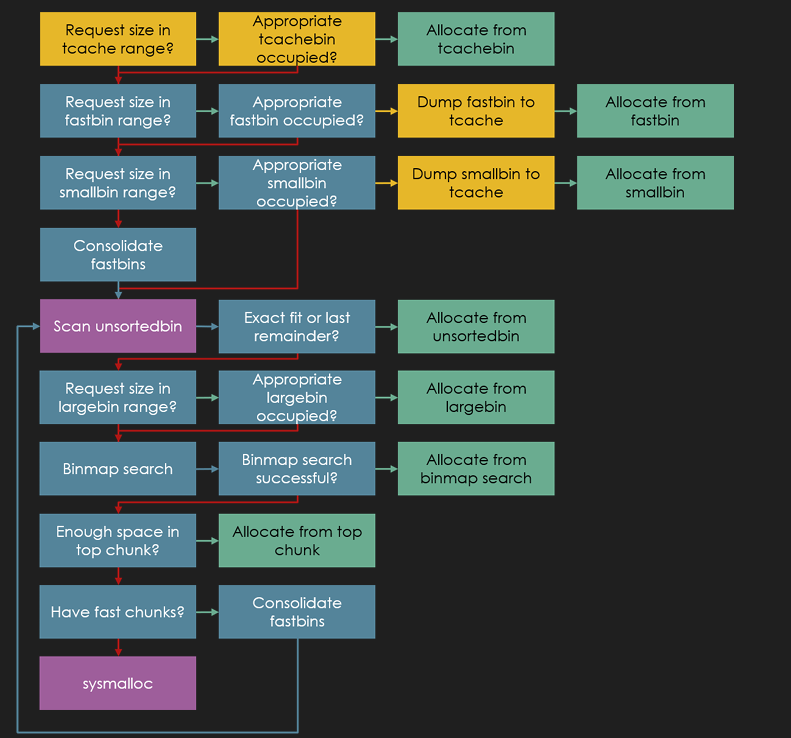
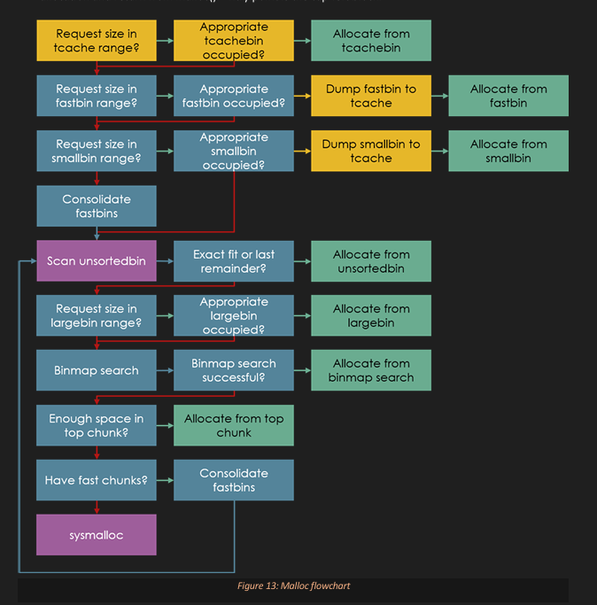
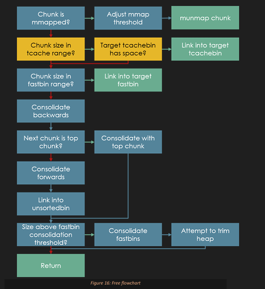
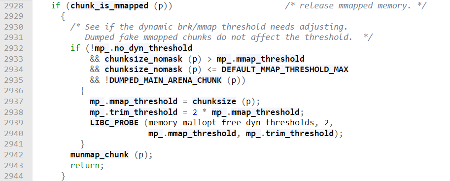

# Overall

- Leverage a heap bug to link a fake chunk into a fastbin, the fake chunk consists of 2 size fields: one belongs to the fake chunk itself and the other belongs to the succeeding chunk’s size field. However, the succeeding chunk’s size field is placed 0x10 bytes before the fake chunk’s size field. The fake chunk wraps around the VA space with a size field of 0xfffffffffffffff1 and the succeeding chunk’s size is set to 0x11 (a so-called fencepost chunk). This is the smallest memory footprint a fake chunk can assume whilst satisfying fastbin next size checks and avoiding consolidation attempts. 
- Once the fake chunk is linked into a fastbin it is consolidated into the unsortedbin via malloc_consolidate(). malloc_consolidate() cannot be triggered via malloc() because this results in the fake chunk being sorted which triggers an abort() call when it fails a size sanity check. Instead the fake chunk is sorted by freeing a chunk that exceeds the FASTBIN_CONSOLIDATION_THRESHOLD (0x10000 by default), this can be achieved by freeing a normal chunk that borders the top chunk because _int_free() considers the entire consolidated space to be the size of the freed chunk.
- Modify the fake chunk size so that it can be sorted into the largest largebin (bin[126]), malloc only searches this bin for very large requests. To qualify for this bin the fake chunk size must be 0x80001 or larger. Sort the fake chunk into bin[126] by requesting a larger chunk. If the arena’s system_mem variable is less than 0x80000, which it will be under default conditions when this heap has not been extended, it is required to artificially increase system_mem by requesting a large chunk, freeing it and requesting it again. 
- Now that the fake chunk is linked into the largest largebin, it is safe to return its size to 0xfffffffffffffff1. Note that such a large size may not be appropriate when attempting to overwrite stack variables as the fake chunk size may be larger than av->system_mem after the allocation. This will fail a size sanity check during subsequent allocation from the unsortedbin. 
- This provides a House of Force-like primitive where a large request can be made from the fake chunk that spans the gap between the fake chunk and target memory. 
# Approach
- Forge a House of Force-like primitive by linking a fake chunk into the largest largebin and setting its size field to a very large value. 
# Further use
- An alternative to using a large fake chunk that wraps around the VA space during the initial link into a fastbin is to use a fake fast chunk with trailing fencepost chunks. This requires more controlled memory but bypasses the size sanity checks in malloc_consolidate() as of GLIBC 2.27. 
# Limitations
- The size vs prev_size check introduced in GLIBC 2.26 means a designer must manually populate the  prev_size field of the fake fencepost chunk.
# Note
- In the House of force, this was easy glimpse versions before 2.8 to 2.9 don't have any top chunk size integrity checks. And as long as the larger request could not be serviced from any of an arenas Binz, the corrupt top chunk would be used. In my situation, however, I don't want to allocate from the top chunk, I want to allocate froma fake chunk.
- Of course, I're going to have to link my fake chunk into an arena, but which bin i link it into is also important.
    - Large requests will only be serviced from the unsorted bin or the appropriate large bin.
    - So I can't just fast bin dup my fake chunk into the fast bins in [House of Lore](/tWZjgCYaQ8qEF4axdBotiA). It's into the small bins, then hope for the best.
    - When a chunk is allocated or sorted from the unsorted bin, it's subject to a size sanity check. This check means that I can't simply allocate our fake junk from the unsorted bin because it needs to be much larger than the check will allow.
    - However, allocations from the large bins are not subject to any size sanity checks. Also, recall that the largest large bid has no cap on the size of requests it can service. So if I can link our fake chunk into the largest large bin, I could safely make arbitrarily large allocations from it. Incidentally, the largest large bin is also known as bin 126 after its position in an arenas bins array, bin 127 is present but unused.
    - -> The quickest route to linking our fake junk into bin at 126 like I do in the House of Lore.

- Unfortunately, my double free bug ability to control such a small amount of junk user data and the fact that I only control one codewords of our fake junk make using this technique difficult, if not impossible. Even if I could leverage the [House of Lore](/tWZjgCYaQ8qEF4axdBotiA) to link our fake chunk into the unsorted bin, then sort it into bin 126 would corrupt the unsorted bin in the process, making progress from there very difficult.
- It would be great if I could just double free a very large chunk, then tamper with its metadata in the same way I've done before in the fast bin dup technique.
    - However, the normal chunk double for mitigation checks, the prev in use flag of the succeeding chunk, something that's out of our reach -> this doesn't work.

***Suitable target:*** fast bin.
- I only need to corrupt a single quad word to reliably link fake chunks into them, which can be done via a fast bin dup.
- And the only metadata our fake chunk would need is an appropriate size field.

***The question is having linked a fake chunk into the fast bins. How would I convince malloc to move it into the largest large bin?***

I can control the size of our fake junk via the age variable, so why don't we just set it to a large value and make the request? 
- The problem with this approach is not only would the fake chunk fail the fast bins size integrity check, but malloc won't even attempt to search the fast bins for such a large request.
- As I mentioned, I needed to move our fake chunk into the large bins for this to work. I learned in the House of Lore technique that chunks are sorted into the large bins via the unsorted bin.
    - So first we'll need to move our fake junk from the fast bins into the unsorted bin.
        - The function named Mallock Consolidate, it's responsible for flushing all the chunks in an arena's vast bins into its unsorted bin, consolidating those chunks along the way if it can.
        - The idea is that if a memory request can't be serviced, it may be because vast chunks are causing a heap fragemetation.
        - If mallock can consolidate any free fast chunks with their surrounding free space via the mallock consolidate function, it may result in a chunk large enough to service the request.
    - Of course, this defeats the purpose of the fast bins, so it only occurs under certain memory pressure conditions.
    
I can't call mallock consolidate directly, it's called from within some of malloc core functions, including from two locations within malloc and one location within free.
- Fortunately for me, indirectly, triggering fast bin consolidation is relatively simple. Referencing the Heap Lab PDF, I can see the two locations within the malloc flow chart that malloc consolidate is called.
    - 
        - This one is easiest to reach. All I have to do is ***request a large chunk that 0x400 size and above.***
        - Once I've done that I were able to trigger malloc consolidate; however, it will fail. 
        - I can check which chunk was being unlinked, the next chunk variable. Malloc is trying to unlink a region of memory just after our fake chunk and malloc consolidate has determined the this doesn't exist.
- I know how mallock determines a forward consolidation candidate, malloc ***looks at the size value of our fake chunk and scrolls forward in memory by that amount to find the next chunk.***
- It then looks at the size value of that chunk scrolls forward again by that amount and it ***checks the prev in use flag of this third chunk*** if the third chunks prev in use flag is clear. That means the chunk after our fake chunk must be a consolidation candidate and malloc will consolidate the fake chunk forward with it.
- The size field it encounters at that address is zero. Malloc doesn't check for size field integrity during this process, so it scrolls forward again by zero bytes.
- Marlock checks the prev in U.S. flag at about a location which is clear, ***indicating that the chunk after our fake chunk is a consolidation candidate.***
- The segmentation fault occurs when malloc tries to dereference NUL quad word, it believes to be forward and backward pointis belonging to this non-existent chunk.
- I'm already preventing backward to consolidation since our fake chunks size field has a set prev in use bit, but that's where our influence ends. If I had more control over memory in this region, I could provide fenceposts chunks, but I only control a single quad word and I need that for a size field.
- *Let's think about this, is there a chunk a size value that can, on its own prevent both backward and forward consolidation? The original House of Rabbit technique required control over two quad word to overcome our consolidation. The fake chunk size would be set to the largest possible value. that's 0xfffffffffffffff1, then a fencepost chunk was placed just before it. This had the effect of making the fake junk its own forward consolidation guard. malloc would look at its size field, scroll forward that amount to find the next chunk, wrapping around the VA space as it did so and coming to a stop at the fencepost chunk just before the fake chunk. Fencepost chunks are illegally-sized 0x10 chunks, and we briefly saw their use by malloc in the House of Orange technique in Part 1. While this approach could work if we controlled 2 nearby quadwords, sadly we only control 1.*

The solution we're going to use also involves making our fake chunk its own forward consolidation guard, just using a different size value. ***That value is 1.***
- Although this time due to an abort rather than a segfault.
- Our fake chunk was able to avoid backward consolidation because it has a set prev_inuse flag and this time it also avoided forward consolidation. Malloc checked its size which is zero, flags don't count towards chunk size, so it scrolled forward in memory to the next chunk by zero bytes -> Our fake chunk is now its own nextchunk -> Malloc checks the size of the next chunk, still zero bytes and scrolls forward again by that amount -> Our fake chunk is now its own next next chunk.
- Since this chunk has a set prev_inuse bit, that means from malloc's point of view, the chunk after our fake chunk isn't free and therefore not a consolidation candidate. 
- The result is that our fake chunk gets legitimately linked into the unsortedbin, avoiding any nasty segfaults.

***It fails***, this is the unsortedbin size sanity check, we've come across it before, albeit briefly, it's there to ensure that unsorted chunks being allocated or sorted have a sensible size value.
- Sensible is defined here as no smaller than a fencepost chunk and no larger than the arena's system_mem value.
    - system_mem value is a record of the total amount of memory this arena has checked out from the kernel. 
- Our fake chunk is subject to this check because it's being sorted as a side effect of the large request we made to trigger malloc_consolidate() in the first place.
    - 
    - We requested a 0x400-sized chunk and a quick look at the malloc flow chart in the PDF indicates that right after malloc_consolidate() is called malloc will search the unsortedbin, coming across our fake chunk, which fails the size sanity check.
- This is a problem, we need to call malloc_consolidate() to move our fake chunk into the unsortedbin and to avoid segfaulting along the way, our fake chunk needs to be an invalid size.

Fortunately, there are a couple of solutions to this dilemma.
- One option is to preemptively free a large chunk into the unsortedbin before our fake chunk gets there. This way, our large request will still trigger malloc_consolidate(), but the large chunk in the unsorted bin will be allocated before the search makes it to our fake chunk. 
- The second option is more efficient however, and it's what we'll use in our exploit.

***Take a look at the free flowchart in the HeapLAB PDF and note the fastbin consolidation event there.***

- When freeing a normal chunk, malloc_consolidate() may be called if the chunk size surpasses something called the fastbin consolidation threshold.
- If we can trigger malloc_consolidated() this way, via free() rather than malloc(), an unsortedbin search won't occur afterwards and our fake chunk will stay safely in the unsortedbin.

***All we need to do is free a chunk larger than the fastbin consolidation threshold.***
- The fastbin consolidation threshold is a constant, different distros make compile their GLIBC binaries with different values, but by default it's set at 65536, or 0x10000.
- Allocating and freeing a chunk of this size won't be an issue in the house_of_rabbit binary, but there's an even more efficient way to do this.
- Notice how the size of the freed chunk is used to determine whether malloc_consolidate() is called after consolidation.
- This means that freeing a small chunk that is subsequently consolidated with a larger chunk can trigger the behavior I want. Even better, this holds true for consolidation with the top chunk.
- I'm going to replace our large chunk with a much smaller one. Then I're going to free it. The request will no longer trigger malloc_consolidate(), instead this chunk will be consolidated with the top chunk in the usual way and its total size afterwards will be compared against the fastbin consolidation threshold. 
- Since our top chunk is much larger than the threshold, malloc_consolidate() will be triggered, but without the subsequent unsortedbin search, leaving our fake chunk in the unsortedbin.

***Afterwards***, I need to do is change our fake chunk size using the amend_age option in the program's menu to 0x80000 or larger, the minimum size that qualifies for bin 126. Then, I'll make a request for an even larger chunk, which should result in our fake chunk being sorted into the largest largebin. Requesting a smaller chunk would have the same effect, but would then remainder our fake chunk, dumping the remainder back into the unsortedbin.
- I could prevent this by stashing a smaller chunk in the unsortedbin that would get allocated after our fake chunk was sorted, but calls to malloc() are at a premium here, so I'll stick with the more efficient course of action.
- Remember I can't set the fake chunk's size to the maximum yet, it still needs to pass the unsortedbin size sanity check as it's sorted into the largebins.
- After that add a call to the malloc function requesting a chunk slightly larger than our latest fake chunk's size.

***Unfortunately***, the program fails again, the reason for this is that the unsortedbin size sanity check has stopped. If it isn't obvious, our fake chunk is still a much larger than the total memory the main arena has checked out from the kernel. From malloc's perspective, that shouldn't happen, hence the abort.
- The problem is our fake chunk can't be any smaller at this point, otherwise it won't get sorted into bin 126.
**So if I can't modify one side of the equation, can I modify the other?**
- ***If system_mem represents the total memory an arena has checked out, couldn't I just request more memory, increasing that value until it reaches the total I want?***
- I're going to request a large chunk that should bring the total memory checked out by the main arena to the size of our fake chunk, 0x80000 or higher. The default heap start size on this distro is 0x21000. So if I keep to round numbers, a chunk size of 0x60000 should increase system_mem to 0x81000.
    - I'll make this allocation at the start of the script so it doesn't interfere with our work so far.
- I're still tripping over the same exploit mitigation, what's going on here? 
- Let's inspect the main arena's system_mem value to check if our idea worked. It hasn't changed. Furthermore, issuing the 'heap' command should show our 0x60000-sized chunk, but it doesn't. 
- It's due to something called the mmap threshold.
    - When malloc receives a particularly large request, it assumes it's a one-off event, that the program won't be frequently allocating and freeing chunks of this size. 
    - So to avoid a situation whereby this very large chunk gets trapped between smaller chunks, unable to be reclaimed by the system, malloc uses the mmap() syscall to request it directly without impacting any heaps.
    - The very large chunk then exists on its own, outside of any heap region, and can be immediately reclaimed by the system via munmap() when the program is done with it.
   
- As an aside, if you noticed that this large chunk doesn't start at the beginning of it's containing mapping, for example by using pwndbg's 'xinfo' command, don't worry, the kernel has final say in the virtual address of mmapped regions and in this case has just appended the large chunk to an existing mapping made by the dynamic loader during process initialization.
    - If you're curious as to why the chunk is a page too large, 0x61000 instead of 0x60000, it's because mmap size granularity is at the page level. 
    - A 0x60000-sized chunk requires one quadword more than 0x60000 bytes to accommodate its unused prev_size field, which leads to that extra page getting mapped.
    - So my 0x60000 chunk ended up here because its size passed a threshold where malloc considers it more efficient to allocate it with mmap() instead of on a heap.
- The "mmap_threshold" variable resides in a struct labeled "mp_" of type "malloc_par", short for "malloc parameters". 
    - I might recognize the "sbrk_base" field of this struct, which we've used a few times as a quick means of finding the start of the default heap.
    - The "mmap_threshold" variable holds its default and minimum value for this distro, 0x20000, as defined as 128 times 1024. 
    - Distro maintainers might tweak this and it can be directly manipulated via a function called mallopt(), which is unfortunately unavailable to me in this scenario.
    
***Our problem is that as long as the mmap threshold remains at this value, we can't allocate large chunks on the default heap to increase its system_mem value.***
- I could of course allocate a series of smaller chunks, but this binary has a cap on total allocations so we need to do this more efficiently.
- ***It used to be the case that the mmap threshold was a fixed value, but nowadays it adapts to the size of chunks a program is using.***
    - For example, if a program is making heavy use of chunks beyond the mmap threshold, allocating them all with mmap() rather than heap space is going to be much slower.
    - And since these chunks are most likely being freed often, the risk of them tying up memory is lessened.
    - In this case, malloc can adjust the mmap threshold to maintain efficiency.
- 
    - "if (chunk is mmapped())" is simply checking for the IS_MMAPPED flag, and these are the important lines of the next IF statement. 
    - If the size of the chunk being freed is beyond the current mmap threshold, increase the mmap threshold to that chunk's size value.
    - -> We can take advantage of this by freeing our 0x60000-sized chunk to increase the mmap threshold, then requesting it again, at which point malloc should allocate it on the default heap rather than via mmap().
- At the start of our script, I'll make a second request for a 0x60000-sized chunk, and between them I'll free the first one. The first 0x60000 request will surpass the mmap threshold and gets allocated via mmap(), as I've just witnessed. 
    - Freeing this chunk will simply unmap it, but in doing so malloc will adjust the mmap threshold to accommodate chunks of this size in the future.
- The second 0x60000 request is now below the mmap threshold and will be allocated from the heap like everything else. 
    - To service this request, malloc will have to extend the top chunk by requesting more memory from the kernel.
    - This, in turn, will increase the main arena's system_mem value, which has been our goal all along.

- To summarize, I used a double-free bug in this binary to link a fake chunk into the fastbins, I can use other bug types to achieve the same thing, but a double-free was all I had to work with here. 
- I then triggered the malloc_consolidate() function to move our fake chunk from the fastbins into the unsortedbin. I did this by freeing a normal chunk that bordered the top chunk, although if I wanted to be more efficient, I could have just freed the second 0x60000 chunk.
- To ensure malloc_consolidate() didn't attempt to consolidate our fake chunk with its surrounding space, I set its prev_inuse flag, preventing backward consolidation and set its size to zero. This meant that our fake chunk became its own next chunk and its own next next chunk, preventing forward consolidation. 
- Once our fake chunk was safely linked into the unsortedbin, I changed its size to 0x80000 the smallest size eligible for the largest largebin or bin 126.
- Before sorting it into that bin, I had to ensure it would pass the unsortedbin size sanity check.
    - Along the way, this meant increasing the arena's system_mem value to the size of our fake chunk or higher.
    - I did this by allocating a 0x60000-sized chunk on the heap, which brought the system_mem total from 0x21000 to 0x81000. 
    - This, in turn, was possible because I had also increased the mmap threshold by requesting, then freeing a 0x60000-sized chunk beforehand, allowing the second 0x60000 chunk to be allocated on the heap rather than via mmap().
- Now that our fake chunk was linked into the largest largebin, which has no size limit, I changed its size to the largest possible value. 
- Finally, thanks to the lack of largebin sanity checks, I  made an allocation from our fake chunk that bridged the gap between itself and our target data. The next request I made was serviced from our fake chunk's remainder, which neatly overlapped the target, allowing us to overwrite it.

- I're going to target the malloc hooks with our arbitrary write, specifically the free hook, since I can free chunks that contain attacker-controlled data. 
- To do this, I'll need to replace the "distance" variable with the distance between our fake chunk and a spot just before the free hook. This should leave the remainder of our fake chunk overlapping the free hook after the subsequent allocation.
- When I allocate that remainder, I'll need to write 1 quadword of garbage to fill the gap between the start of chunk user data and the free hook because the free hook isn't 16-byte-aligned.
- However, I're failing the unsortedbin size sanity check again. 
    - Now, the reason for this can be a little hard to track down.
    - The chunk that's failing the size sanity check is the remainder of our fake chunk, which now sits just before the free hook.
    - The size of this chunk is far in excess of even the artificially inflated system_mem value that I're dealing with.
    - The reason this mitigation wasn't triggered in my previous exploit is that I allocated so much of the original fake chunk's space to bridge the gap between it and the target data that the remainder's size fell back into a valid range.
    - In this case, I're only requesting a tiny portion of the huge fake chunk to bridge a much smaller gap, one that doesn't wrap around the VA space. 
    - This leaves the remainder much larger than its arena's system_mem value.
- The solution to this problem is simple; I control the size of the fake chunk, so instead of setting it to the largest possible value, let's just keep it much smaller.
